# Fine-tuning TorToiSe's GPT Model with Colab

This is an (experimental) instruction guide to fine-tuning :turtle: on Google Colab. If you experience any errors/difficulties in using the notebook, **report them [here](https://github.com/152334H/DL-Art-School/issues/2)**.

## [Click me](https://colab.research.google.com/drive/1-KmMuexR9Mv40QHNt_If2YY8nx3rFi4a) to visit the colab notebook!

## Before running anything...

You need to prepare an **LJSpeech** formatted dataset to be used with training.

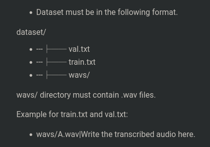

Upload your dataset to a folder on your personal Google Drive.

* If you have a lot of files, you might want to upload a compressed archive and write code to extract it in the notebook (but if you cannot do this, then that's okay, just wait for the upload to finish)

## Using the notebook

**Before starting**, check that your runtime type is a **GPU** (`Runtime -> Change runtime type`):

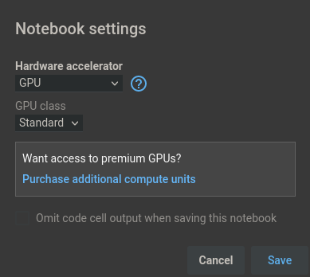

The best GPU offered by Colab's free tier is a Tesla T4:

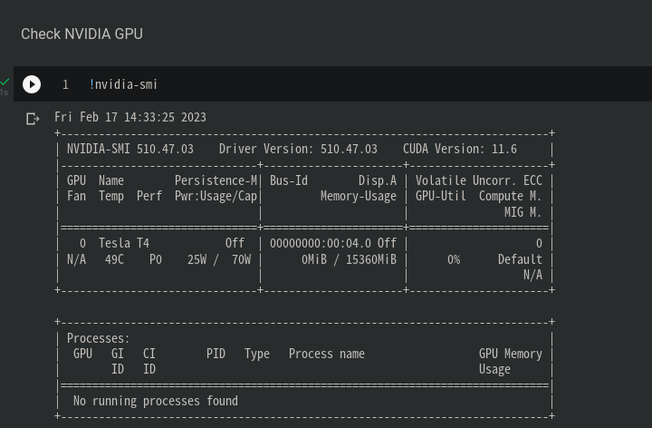

If you get a K80 (or something worse) with less vram, you might want to restart the runtime to reroll for a better GPU.

With that settled, click the first play button to start the notebook. You should get a message like this:

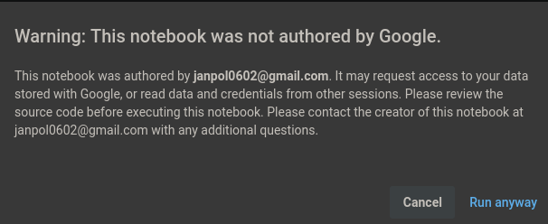

* Although I have edit permissions on the notebook, it was **not authored by me**, and mounts your personal Google Drive folder, so if you are particularly paranoid, you may want to read the code contained in the notebook before running anything.

Once the first cell finishes, you can run the next cell to install DLAS:

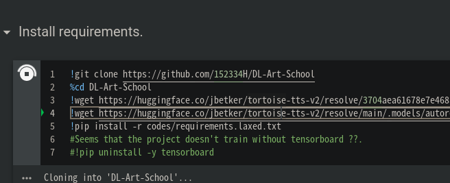

This should take less-than 5 minutes to run.

* If you receive an error at this point (or at any point later on), please report the problem.

---

### Everything after this section is likely to change in the future

The next step requires the full paths to your dataset:

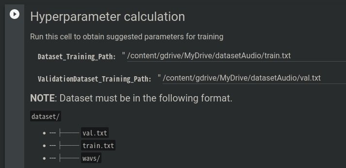

The cell will calculate recommended training parameters for you, based off of the dataset you provide. The calculated values are very rough, and you should feel free to change them if you know some ML.

* `Dataset_Training_Path` should point to the **full path** of `train.txt`, e.g. `/content/gdrive/MyDrive/mydatasetname/train.txt`, and `ValidationDataset_Training_Path` should point to the same for `val.txt`.
* It is okay if the text files are not exactly named `train.txt` or `val.txt`, but they must be LJSpeech formatted.

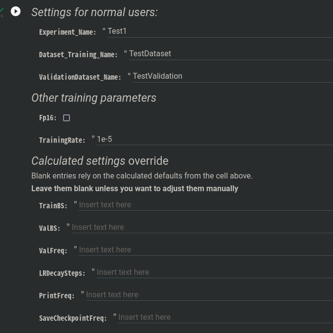

The next cell lists all the options you can configure for training. Here are short explanations of all of them:

##### Normal settings (vanity)
* `Experiment_Name`: name of experiment; this determines the folder name for saved checkpoints
* `Dataset_Training_Name` / `ValidationDataset_Name`: redundant afaik

##### Other training parameters
* `Fp16`: train in half precision rather than full precision. **Not tested**, likely to reduce vram usage at the cost of quality.
* `TrainingRate`: starting learning rate for training. Feel free to slightly increase/decrease this, but the value of 1e-5 has been good experimentally.

##### Calculated settings
These settings are calculated by default. Writing values in them overrides the calculated values.
* `TrainBS` / `ValBS`: training/validation batch size. I do not recommend changing this unless you know what you're doing; batches do not split evenly, and some training files will be lost if the batch sizes aren't selected intelligently. Also, when batch size &lt; dataset size, the training bugs out.
* `ValFreq`: number of steps between each run of the validation dataset. This is poorly named because "frequency" should be the inverse of the number of steps, but it isn't.
* `LRDecaySteps`: an **array** with **4 integers** containing steps at which the learning rate should decay. Really don't change this unless you know what you're doing.
* `PrintFreq`: number of steps between each info print (showing the epoch, step count, and all the training results). Feel free to reduce/increase this if you want the training to be more/less verbose. This is also poorly named.
* `SaveCheckpointFreq`: number of steps between each checkpoint save. Don't reduce this too far -- many checkpoints means more disk space consumption && more time wasted on i/o. This is also poorly named. 

    ---

If you don't receive any errors running the config cell, you can press the training button:

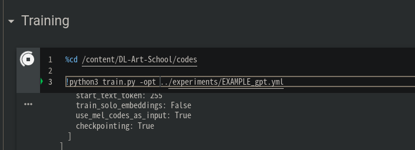

The training will take **a long amount of time**, and must be **manually stopped** when you think the results are good enough.

* If the cell stops very quickly (&lt;5mins), something probably went wrong and you should post the logs to discussion/issues.
* The smaller your dataset, the faster the training parameters are designed to "stop training". This means that smaller datasets will both take less time to train && be more likely to not work out.
* If you see the printed loss numbers increase, something has probably gone wrong

Once you are satisfied with the training, **and you have seen an `INFO` log saving checkpoints recently**, click the stop button on the training cell:

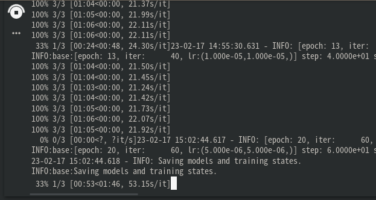

And then run the last cell to copy the trained weights/logs to your google drive folder:

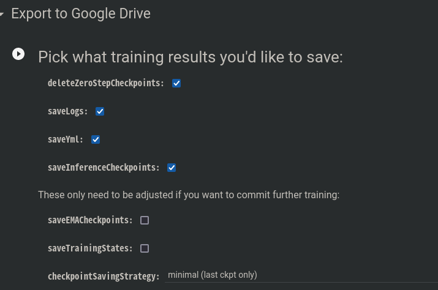

Please ensure you have at least 2GB of free space on Google Drive before running that.

The default options should leave you with a gdrive folder tree like this:

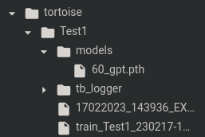

The exported files will allow you to run **inference** with [tortoise-tts-fast](https://github.com/152334H/tortoise-tts-fast), but not further training. The training states occupy a lot of disk space, and I do not recommend copying them out unless you have a lot of Google Drive space to spare.

### For advanced users only

The full .yml config can be found at `/content/DL-Art-School/experiments/EXAMPLE_gpt.yml`. You may edit it directly by double-clicking on it at the file explorer:

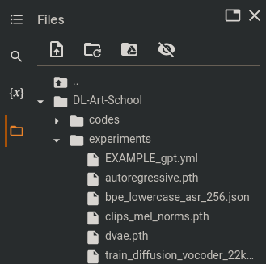

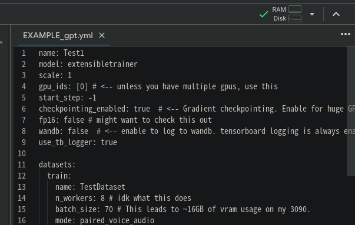

**There should be no need to do this**; this is just an extra note for people who understand the DLAS config files well.

### Using the trained models

go to tortoise-tts-fast and use do_tts.py with the --ar-checkpoint flag
